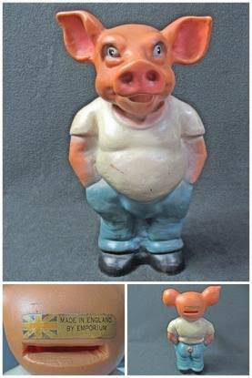

---
title:　イギリス製の豚の貯金箱？。#9
date: "2020-05-14"
description: ""
---

ぴぴぴぴぴ、ぴぴぴぴぴ、ぴぴぴぴぴ！

iphpne から聞こえる目覚ましアラーム音を止めては、もう一度夢を見る日々が続いております。

あいかわらずねぼすけな瞼をにらみつつ、体を起こしております。

昨日は、つい夜中まで仕事をしてた影響なのか今もとても頭が眠ってる気がしてる。ｗ

やっぱ睡眠はちゃんと取らなきゃな。。

まあそんなことは置いといて。

数年前かな。

地元の服屋さんでフリマがあった際に面白いモノを買ったんですよね。

イギリス製の貯金箱。

ん？貯金箱？？？？？

僕の思ってる豚の貯金箱と全然違う。

イギリスの貯金箱ってみんなこんなでかいのか？！

とか思ったり。(そんなわけない)

結構これでかいんだよね。3,40cm はあるかも。

引っ越す際のノリでこいつも共に上京してきた関係で
クローゼットにぶち込んでいる状況です。

だいぶ古いのか年代までは読めないのですが、

もし欲しい人いたらあげたいな。(いらんよね。w)

いつかこの商品をインフルエンサーとかが紹介してプレ値とかつかないかなとか思ったり思わなかったり。

お洒落な人は、こういうのもうまくインテリアにするんやろな。

豚の貯金箱って、風水で言うところの金運パワーを司る方位「西」に置くと、相乗効果で、さらにお金がたくさん貯まるようになるらしいですよ。

金運はブタさんのお尻から入ってくるとも言われていますので、

置き方としては西側にお尻を手前にして

（ブタさんを後ろ向きにして）置いてみるといいらしいです。

持ってる人は是非試してみてね。

きょうはこんなもんで納めて、俺の豚貯金箱をこれからどうするかをうっすら決めていこうかと思います。

欲しい人いたら連絡ください。。。

今日も読んでくれてありがとうね～。
