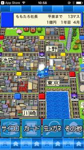

GW 明けて、仕事モードになったと思ったらもう週末になるじゃん。

まあここ最近毎日休みみたいなもので、曜日感覚なんてないんですが。笑

やっぱ時間ができるとスマホと密な関係になっちゃうので、ついつい色んな興味が湧いてくるんですよね。

ある日のことなんですが、メルカリを見ていた時に”スーファミ”が飛び込んできたんですよ。

よくお父さんと一緒にマリカーや、ドンキーコングとかめちゃくちゃしたなあ。

あ。桃鉄(サイコロ振って日本全国の物件を買って一番利益がでた人が勝つゲーム)がしたい。

思った時には、スマホアプリの検索に「桃太郎電鉄」と検索してました。

スマホアプリであるんかい！とも思いましたが課金必要でしかも￥ 800 ?!

気付いたら指紋認証をしてました。(買ってしまった。。)

ちなみに僕の地元の島根とお隣の鳥取県にある物件は

・松江

・石見銀山

・益田

・津和野

・米子

・鳥取

でした。島根やけに多ない？？(嬉しい)

そんなこんなで個人的に桃鉄のお陰で、日本全国地図とか地名を覚えたと言っても過言じゃないんですよね。

いやあー、だけん社会が好きだったんかな～。

ゲームやってると、ボンビーという鬼みたいなのが付いてくるんですよね。

あれがまあ厄介で物件勝手に売られたり所持金減らされたり。。。

しかも急に変身してキングボンビーとかいうのに付いたらもうタダじゃすみませんよ。

勝手に日本の端っこに飛ばされたり、物件全部売られたり、億単位でお金減らされるし。

コロナショックばりの経済危機が陥るんですよ。

こういうのが今ホントに他人事ではあるんですが起こっているという事実を受け止めないとなとも思ったりしますね。

予言とかは信じる信じないは置いといて話は楽しいんで良く耳を傾けるのですが、

今回のこの騒動を通じて人類の選別ってホントに起こってるのかなって自分も思いますね。

自分には何ができるのか。何でもいい。でも努力の方向音痴にはならない。もう一度自分の出来る事を精一杯やっていこうと思った次第であります。

桃鉄の方は、最終的にはサイコロに決められる人生なんかゴメンだ！ってなってもう辞めちゃいました。

熱しやすくて冷めやすいタイプなのでホントに気分屋的なところどうかしたいものです。ｗ

今日も読んでくれてありがとうね～！
